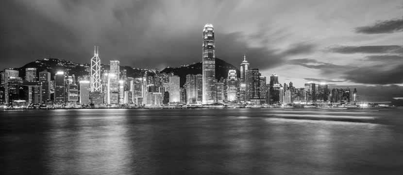

# GrayScale Converter Algorithm
  The change of colored image to grayscale image is a basic and primordial algorithm in image processing/ computer vision world.
This operation enables an innumerable of others operations (detect objects / analyze characteristics of image / equalize / etc).
In this folder have grayscale converter algorithm inplementation in C++ and Python(I added some more things in python implementation to analyze the change of the image data after this operation ).

## What this algorithm do?
  This algorithm convert an RGB matrix(3 channels) in a simple gray scale image (1 channel).This operation allows the use of several computer vision/image processing algorithms(thresholding,canny,equalzation,etc).

'''

''

## Statistical Graphics
   When the code is executed, it will generate some statistical graphs.These charts represent the distribution / value of the pixels

## Authors
	* **Ionésio Junior**
