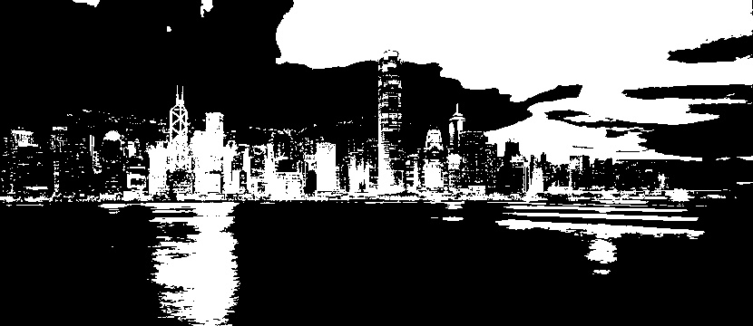
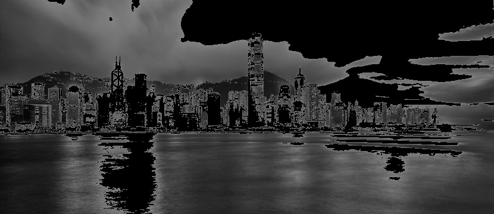

# Thresholding
  Thresholding is a image processing operation used to filter an specific interval of pixel values in some image.Have many variations of this algorithm.In this repository have only 5 different thresholding types.

## What this algorithm do?
	Filter specific interval of pixel values in some image.
<p align="center"></p>
<p align="center"></p>
<p align="center"></p>
<p align="center"></p>
<p align="center"></p>
<p align="center"></p>


## Types of Thresholding

In this repository you will find the following thresholding algorithms:

```
- BinaryThresholding
- InvertedBinaryThresholding
- Truncate
- ThresholdingToZero
- InvertedThresholdingToZero

```

## Authors

* **Ionésio Junior** 
