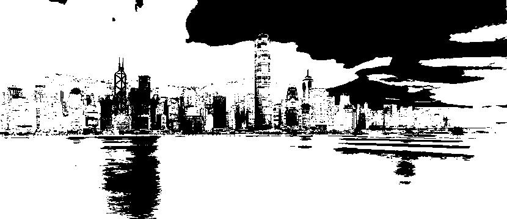

# Thresholding
  Thresholding is a image processing operation used to filter an specific interval of pixel values in some image.Have many variations of this algorithm.In this repository have only 5 different thresholding types.

## Types of Thresholding

### Binary Thresholding type
	This thresholding algorithm change all pixel values greater than the threshold to 0 and change to 255 other values.

binary threshold result

Opencv image binary thresholding operation

